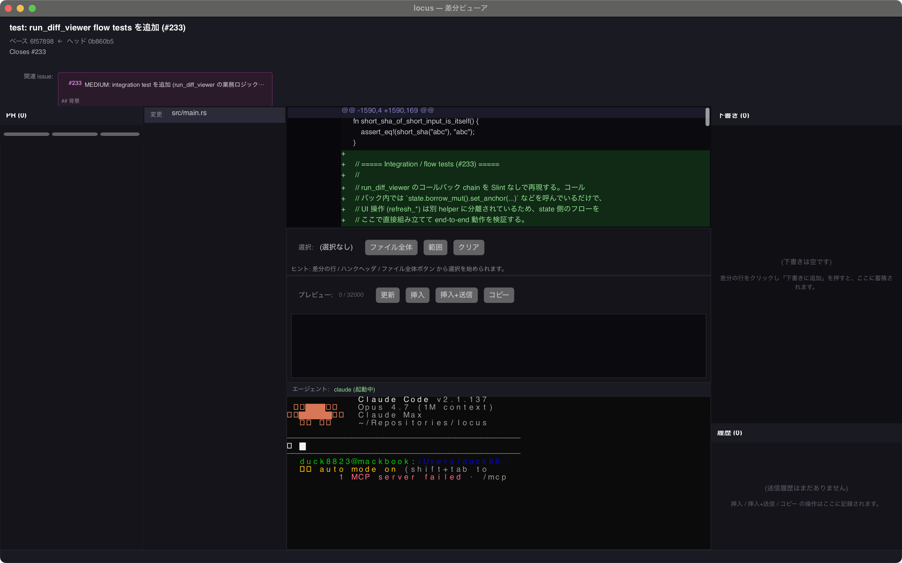
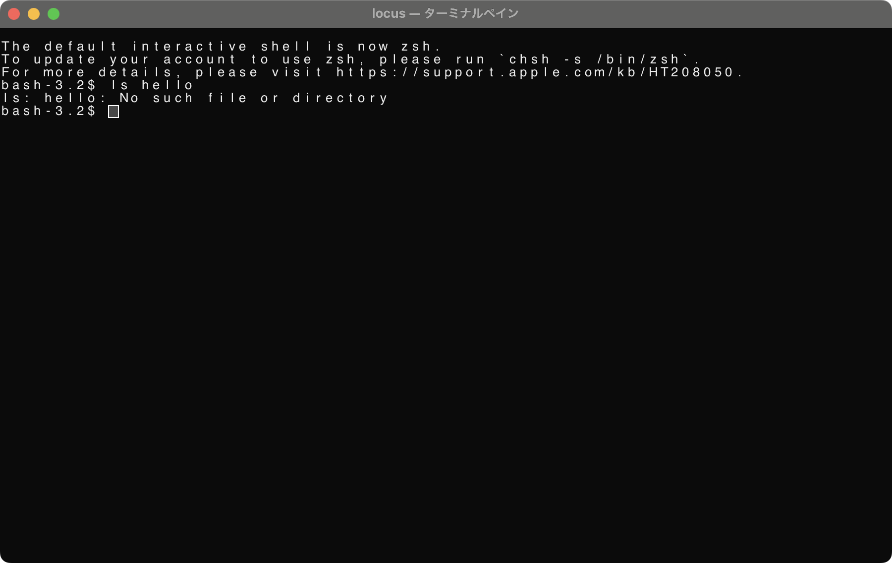

<div align="center">

# Locus

**From "diff checking" to "understanding the meaning of changes".**

[](LICENSE)
[](LICENSE.ja.md)
[]()
[](README.ja.md)

</div>

---

## Status: beta (v0.0.x patch sprint)

Locus is a **local native application** for macOS, built in Rust + Slint, that hosts a GitHub PR diff viewer next to an embedded terminal running your agent CLI (Claude Code / Codex / Gemini). It is currently in a v0.0.x beta sprint stabilizing toward `v0.1: core review loop`.



The diff pane on the left, the terminal pane on the bottom hosting an agent CLI, and the draft / history side panel on the right. A `cargo run` without arguments opens just the terminal pane:



The original Next.js web prototype is preserved on the [`legacy/nextjs`](https://github.com/duck8823/locus/tree/legacy/nextjs) branch.

## Quickstart

Requirements: Rust 1.85+ (uses `edition = "2024"`), macOS.

```sh
# Clone and build
git clone https://github.com/duck8823/locus.git
cd locus
cargo build --release

# Terminal-pane only (default agent: claude)
cargo run --release

# Terminal-pane with a custom CLI
cargo run --release -- bash
LOCUS_AGENT_CMD=codex cargo run --release

# Diff viewer for a GitHub PR
cargo run --release -- github duck8823/locus#236
```

If `LOCUS_AGENT_CMD` is set to an executable that is not on `PATH`, locus shows a red banner and disables the send buttons rather than crashing.

For GitHub access, locus reads tokens in this order:

1. `GITHUB_TOKEN`
2. `GH_TOKEN`
3. `gh auth token --hostname github.com` (set `LOCUS_NO_GH_AUTH=1` to disable this fallback)
4. unauthenticated (limited rate)

## Environment variables

| Variable | Default | Purpose |
|---|---|---|
| `LOCUS_LOCALE` | system / `LANG` | `ja` or `en`. Reads `LANG` when unset; falls back to `ja` for unsupported values. |
| `LOCUS_AGENT_CMD` | `claude` | Command launched in the embedded terminal pane. |
| `LOCUS_FONT_FAMILY` | OS-specific (macOS: `Menlo, Hiragino Sans, Apple Symbols, Apple Color Emoji, Consolas, monospace`) | Font family for diff / chrome. If `LOCUS_TERMINAL_FONT_FAMILY` is unset, this also overrides terminal fonts. |
| `LOCUS_TERMINAL_FONT_FAMILY` | OS-specific (macOS: `SF Mono, Menlo, Monaco, Osaka-Mono, Hiragino Sans, Apple Symbols, Apple Color Emoji, monospace`) | Terminal-grid-only font fallback chain. Prefer monospace candidates first; useful when terminal glyphs or cell metrics look broken. |
| `LOCUS_FONT_SIZE` | (unset) | Single override for both terminal and diff font sizes. |
| `LOCUS_TERMINAL_FONT_SIZE` | `13.0` | Terminal pane font size in logical pixels. |
| `LOCUS_TERMINAL_CELL_W` / `LOCUS_TERMINAL_CELL_H` | fallback ratio (`font_size * 0.6` / `font_size * 1.45`) | Manual terminal cell width/height override in logical pixels. Always wins over both probe and fallback. Use for diagnosing glyph/cell metric mismatch. |
| `LOCUS_TERMINAL_PROBE_METRICS` | `false` | `1`/`true`/`on`/`yes` to opt back into the Slint hidden-Text probe (`measured-terminal-cell-w/h`) for cell metrics. Default is off because the probe overestimates advance and underestimates line-height for SF Mono / Menlo on macOS, garbling terminal text (#292 / #289); the ratio fallback or `LOCUS_TERMINAL_CELL_W/H` override is used instead. |
| `LOCUS_TERMINAL_DEBUG_GRID` | `false` | `1`/`true`/`on`/`yes` to draw thin grid lines at terminal cell boundaries so cell-vs-glyph mismatches are visible at a glance. Layout is unchanged. |
| `LOCUS_DIFF_FONT_SIZE` | `12.0` | Diff pane font size in logical pixels. |
| `LOCUS_BRACKETED_PASTE` | `true` | `false`/`0`/`off`/`no` to send raw bytes when the agent CLI does not understand `\x1b[200~ ... \x1b[201~`. |
| `LOCUS_PROMPT_MAX_CHARS` | `32000` | Preview is gated above this character count; an override checkbox allows sending anyway. |
| `GITHUB_TOKEN` / `GH_TOKEN` | (unset) | GitHub PAT for the diff viewer. |
| `LOCUS_NO_GH_AUTH` | `false` | Disable the `gh auth token` fallback. |
| `GH_AUTH_TIMEOUT` | `3` | Seconds before the `gh auth token` subprocess is killed. |
| `LOCUS_LOG` | `warn` | Tracing filter (`error` / `warn` / `info` / `debug` / `trace`). At `debug`, perf traces (preview refresh, terminal resize, session save, PR/issue fetch elapsed_ms) are also emitted. |

## Keybindings

Implemented in v0.0.2 (full set lands in v0.1.0):

| Key | Action |
|---|---|
| Esc | clear the current selection |
| Cmd/Ctrl + Enter | Insert + Send the preview into the terminal |
| Cmd/Ctrl + C | Copy the preview to the clipboard |

Send shortcuts respect the preview-size limit and are disabled when over `LOCUS_PROMPT_MAX_CHARS` unless the override checkbox is on.

## The key design shift: no in-app LLM

Locus **does not call LLMs itself**. Instead, it hosts a Terminal pane (built on `alacritty_terminal` + `portable-pty`) where Claude Code / Codex / Gemini run as child processes. The Viewer composes structured prompts from the PR / diff / comment selection and **sends them to the Terminal pane**. Authentication, provider selection, cost control, and review history all live in the agent CLI of your choice — not in Locus.

## Core stack

- **Rust + Slint** — native UI
- **`alacritty_terminal` + `portable-pty`** — terminal pane hosting the agent CLI
- **`tree-sitter-go`** (first target language) — semantic diff
- **`octocrab`** — GitHub PR snapshots

## Diagnostics for LLM

`scripts/diagnose_ui.sh` is a self-contained harness for an LLM (or anyone) to launch locus on a real desktop, capture logs, and verify visual / perf state without sitting in front of the screen for every iteration. It builds with `cargo build`, launches `target/debug/locus` with `LOCUS_LOG=debug` and the terminal cell debug grid on by default (`--no-debug-grid` disables it), sleeps for `--duration` seconds (default `8`), best-effort focuses the launched process with `osascript`, takes a `screencapture` screenshot when available, and terminates the launched PID gracefully (TERM → KILL) without touching unrelated processes.

```sh
# terminal-only mode with sh as the inner agent CLI
scripts/diagnose_ui.sh terminal --duration 6

# diff viewer mode against an existing PR
scripts/diagnose_ui.sh github duck8823/locus#236 --duration 10

# tweak terminal grid metrics / fonts (passes through as env overrides)
scripts/diagnose_ui.sh terminal \
  --cell-w 8 --cell-h 18 \
  --terminal-font-size 14 \
  --font-family "SF Mono, Menlo, monospace"

# opt into the Slint font probe to compare against the default fallback metrics
scripts/diagnose_ui.sh github duck8823/locus#236 --probe-metrics --duration 10

# pin the front window to a known size for reproducible min-size screenshots (macOS)
scripts/diagnose_ui.sh terminal --window-size 1280x720 --duration 6

# inject scripted input/scroll interactions and summarize latency artifacts (macOS)
scripts/diagnose_ui.sh terminal \
  --interaction terminal-type \
  --interaction terminal-scroll \
  --interaction-delay 1 \
  --duration 4

# diff-viewer file switch interaction (requires github mode)
scripts/diagnose_ui.sh github duck8823/locus#236 \
  --interaction file-switch-next \
  --interaction-delay 2 \
  --duration 6

# reuse a previous build (skip cargo build)
scripts/diagnose_ui.sh terminal --no-build --out-dir target/locus-diagnostics/run-A
```

`terminal-type` uses macOS System Events via `osascript`. `terminal-scroll`
uses Quartz through Python (`pyobjc-framework-Quartz`). `file-switch-next`
arms a single app-side diagnostic timer in `github` mode and must be the only
interaction in that run. When interactions are requested, `--interaction-delay`
must be less than or equal to `--duration` so short smoke diagnostics do not
wait longer than their requested run time. When the required tools, mode, or
permissions are missing, the harness records a skipped/failed interaction in
the artifacts instead of failing the whole run.

Every run drops these files into `--out-dir` (default `target/locus-diagnostics/<timestamp>/`):
the default location is under `target/`, so these artifacts are ignored by git
unless you explicitly choose an output directory inside the working tree.

| File | Contents |
|---|---|
| `app.log` | stdout/stderr from `target/debug/locus` (no build noise mixed in) |
| `build.log` | `cargo build` output (omitted with `--no-build`) |
| `command.txt` | resolved argv and the exact env vars injected into the child |
| `env.txt` | filtered environment snapshot for reproduction; credential-like variables are redacted |
| `perf_summary.txt` | grep counts and matched lines for `preview refreshed` / `terminal resized` / `terminal input forwarded` / `terminal input forward failed` / `terminal scroll event` / `terminal render tick` / `terminal render idle flush` / `file switch requested` / `diagnostic file switch` / `window session saved` / `pr session saved` / `linked issues fetched` / `initial hydrate ...`, plus a tail of WARN/ERROR/panic lines |
| `screenshot.png` | desktop screenshot taken mid-run (only when `screencapture` is available and succeeds) |
| `interaction_events.jsonl` | scripted interaction start/done/skipped/failed events with timestamps and status (only when `--interaction` is used) |
| `interaction_summary.json` | interaction counts plus best-effort latency summaries/statistics by matching `interaction_events.jsonl` with `app.log`; `observed=false` / `unobserved` means the input was injected but no matching app log was seen |
| `report.json` | mode, command, env overrides, duration, exit status, screenshot/focus status, artifact paths, tool availability, free-form notes |

When `cargo build` fails, the binary is missing, or locus exits before the harness terminates it, the script still writes `report.json` and exits non-zero (propagating the child's exit status when available) so an LLM caller can read the failure mode programmatically instead of inferring it from missing files. A clean run (locus is still alive after `--duration` and shuts down on TERM) exits 0.

## What's in this repo right now

- `Cargo.toml` / `src/` / `ui/` / `build.rs` — Rust + Slint binary
- `docs/adr/` — architectural decisions, including the rewrite (0005) and `thread_local DIFF_APP_STATE` rationale (0006)
- `docs/architecture/` — parser adapter + IR pipeline
- `docs/mvp.*` — historical MVP scope (retained for context)
- `lang/ja/LC_MESSAGES/locus.po` — Japanese bundled translations

Everything else from the Next.js era lives on [`legacy/nextjs`](https://github.com/duck8823/locus/tree/legacy/nextjs).

## License

MIT — see [LICENSE](LICENSE). Japanese reference translation: [LICENSE.ja.md](LICENSE.ja.md).
